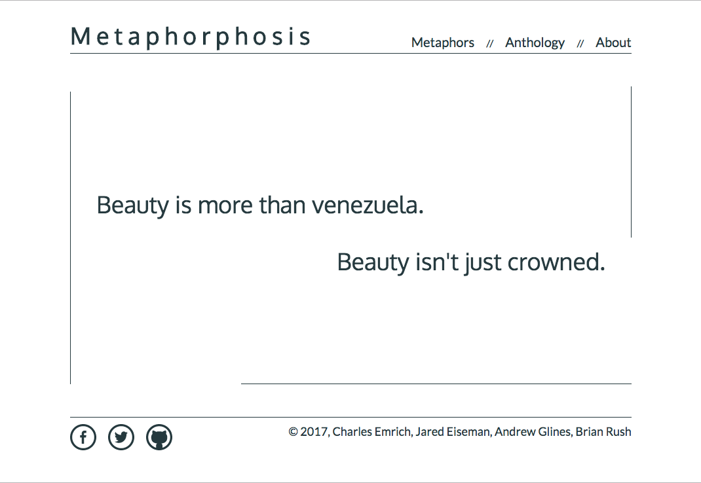
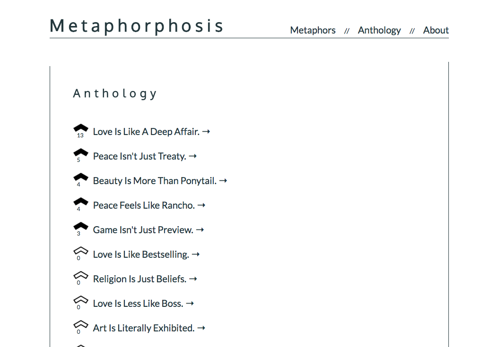
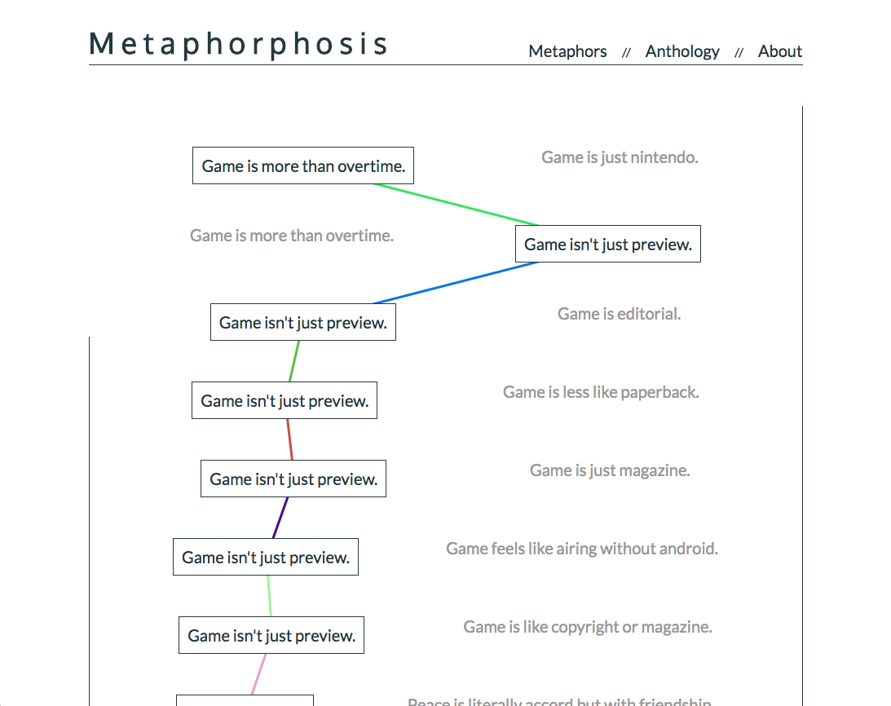

# Metaphorphosis

#### Metaphorphosis is a web app exploring simple computational linguistics and generative literature.

#### By Jared Eiseman, Charles Emrich, Andrew Glines, and Brian Rush

## Description
Seeded with a handful of complex, ambiguous, polysemic, or hard-to-define concepts (such as 'love,' 'play,' or 'art'), Metaphorphosis generates and presents to the user pairs of statements (originally metaphors). The user may choose one of the statements and the web app will replace the unchosen one with a new statement or metaphor based on the chosen one.



If a statement is chosen enough times (in a single session) it will be included in the "Anthology," a sort of hall of fame, where it may be seen and upvoted by other users.



A user can also click on the arrow next to a statement to see the journey a user took through their session, revealing something of the logic that morphed the statements toward the concepts they arrived at.




## Specifications

* The app will randomly choose from a set of predetermined concepts when building statements / metaphors.
  * [concept1, concept2, concept3...]
  * return values
* The app will be able to generate a metaphor / statement.
  * Method initially triggered by app load, then user feedback
  * Example: "Politics is like a game"
    * App will query the Datamuse API for words related to the seeded concept (hyper/hyponyms).
      * Entry method for building metaphor will trigger this
      * Return hyper/hyponyms
    * Returned value for Datamuse will be used in conjunction with RiTa API to construct a new metaphor
      * Successful promise resolution from Datamuse query
      * New metaphor will be returned "War is like conflict"
* The user will be presented with two related metaphors
  * Page load
  * Two metaphors displayed to screen
* User will be able to choose between the two metaphors presented as to which one is preferable to the user
  * Selection clicked
  * The two current strings, as well as the one selected stored to database in session generated from page load
* Once a threshold has been reached for a metaphor being selected repeatedly, the string will be stored to an "anthology" and replaced with a new metaphor based on a new concept
  * Metaphor has been selected as the preferred choice X times
  * Stored to anthology "table" to be displayed on separate view

## Set up / Installation

### Set-Up Requirements

* Web browser with ES6 compatibility
* Node.js
* npm (Node Package Manager)
* Bower
* Firebase
* Angular (we used Angular4)
* Typescript
* Git

### Setup / Installation

Open your terminal and clone this repository with the following command:

```
$ git clone https://github.com/aglines-epicodus/metaphorphosis.git
```

Move into the cloned repository:

```
$ cd metaphorphosis
```

Create an api-keys.ts file:

```
$ touch src/app/api-keys.ts
```

* Go to [Firebase](http://firebase.google.com) and sign up for an account
* Once signed up, click on "Go to Console"
* Then, "Add project" and add your project's name
* From there, click on "Add Firebase to your Web App"
* Finally, add the information from the pop up modal from Firebase to your api-keys.ts file (it should look something like this, but replace the "xxxxx" information inside the masterFirebaseConfig with your own unique information):

```
export var masterFirebaseConfig = {
  apiKey: "xxxxx",
  authDomain: "xxxxx",
  databaseURL: "xxxxx",
  projectId: "xxxxx",
  storageBucket: "",
  messagingSenderId: "xxxxx"
};
```

Install necessary packages with:

```
$ npm install
$ bower install
```

Run a dev server with:

```
$ ng serve
```

To see and interact with the web app, visit the following address in your browser:

```
localhost:4200
```

The app will automatically reload if you change any of the source files.

### Code scaffolding

Run `ng generate component component-name` to generate a new component. You can also use `ng generate directive|pipe|service|class|module`.

### Build

Run `ng build` to build the project. The build artifacts will be stored in the `dist/` directory. Use the `-prod` flag for a production build.

### Running unit tests

Run `ng test` to execute the unit tests via [Karma](https://karma-runner.github.io).

### Running end-to-end tests

Run `ng e2e` to execute the end-to-end tests via [Protractor](http://www.protractortest.org/).
Before running the tests make sure you are serving the app via `ng serve`.

### Further help

To get more help on the Angular CLI use `ng help` or go check out the [Angular CLI README](https://github.com/angular/angular-cli/blob/master/README.md).


## Known Bugs

There are no known bugs at this time.
* The connecting lines on the Hall of Fame page go out of proper alignment if browser window is resized.

## Support and contact details

For feedback or support file an issue in the repository.

## Technologies Used

* HTML
* CSS
* SASS (.scss)
* JavaScript
* Angular4
* [Angular CLI](https://github.com/angular/angular-cli) version 1.2.0.
* Datamuse API
* RiTa library (Version 1.2.12; Howe 2015)

### License

MIT

©️2017 Jared Eiseman, Charles Emrich, Andrew Glines, and Brian Rush
